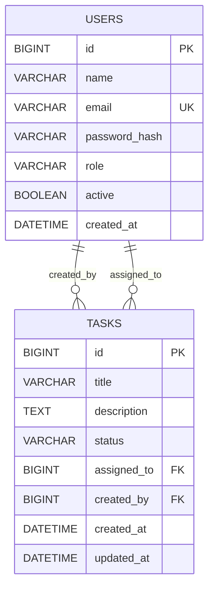

# TeamFlow Lite - Task Management App

TeamFlow Lite is a full-stack task manager for small teams.  
It supports authentication, role-based access (`ADMIN` / `USER`), task assignment, task status tracking, and user deactivation.

## Tech Stack

- Frontend: React + Vite + Axios
- Backend: Spring Boot 3, Spring Security (JWT), Spring Data JPA
- Database: MySQL 8
- DevOps: Docker, Docker Compose, GitHub Actions

## Features

- Secure auth with hashed passwords and JWT login
- Task CRUD with status workflow: `TODO`, `IN_PROGRESS`, `DONE`
- Task filtering by `status` and `assignedTo` 
- Role-based authorization:
  - `ADMIN`: manage users, view all tasks, delete tasks
  - `USER`: create/update permitted tasks
- User deactivation flow:
  - Admin can deactivate users
  - Deactivated users cannot login or call secured APIs

## API Overview

### Auth
- `POST /api/auth/register`
- `POST /api/auth/login`
- `POST /api/auth/recover/reactivate` (Emergency recovery)

### Users
- `GET /api/users` (Admin)
- `GET /api/users/assignees` (Any authenticated user, active users only)
- `GET /api/users/{id}` (Admin)
- `POST /api/users` (Admin)
- `PATCH /api/users/{id}/deactivate` (Admin)

### Tasks
- `POST /api/tasks`
- `GET /api/tasks`
- `GET /api/tasks/{id}`
- `PUT /api/tasks/{id}`
- `DELETE /api/tasks/{id}` (Admin only)

Filter examples:
- `GET /api/tasks?status=TODO`
- `GET /api/tasks?assignedTo=2`
- `GET /api/tasks?status=IN_PROGRESS&assignedTo=2`

## ERD



## Run Locally

### Prerequisites

- Java 17+
- Node 20+
- MySQL 8 running locally

### 1) Backend

```bash
cd backend
./mvnw spring-boot:run
```

Backend runs at `http://localhost:8080`.

Default local DB values come from `backend/src/main/resources/application.properties`:
- URL: `jdbc:mysql://localhost:3306/taskdb?...`
- Username: `root`
- Password: `gill2000`


### 2) Frontend

```bash
cd frontend
npm ci
npm run dev
```

Frontend runs at `http://localhost:5173`.

## Run with Docker

### 1) Prepare env file

```bash
cp .env.example .env
```

### 2) Build backend jar

```bash
cd backend
./mvnw -DskipTests package
cd ..
```

### 3) Start stack

```bash
docker compose up --build
```

Services:
- Frontend: `http://localhost:4173`
- Backend: `http://localhost:8080`
- MySQL: `localhost:3307` (mapped from container `3306`)

## Test Users and Flow

### Initial setup

1. Register the first account from UI (`/register`).
2. The first registered user becomes `ADMIN`.
3. Login and open **Users** page.

### Recommended test flow

1. As admin, create a normal user.
2. As admin, create and assign tasks.
3. Use task filters by status and assignee together.
4. Change a task to `DONE`, then edit it again and update status (should work).
5. Deactivate a user from **Users** page.
6. Verify the deactivated user can no longer login.

## CI

CI workflow is at `.github/workflows/ci.yml` and runs:
- Backend build/tests
- Frontend build
- Docker image builds

